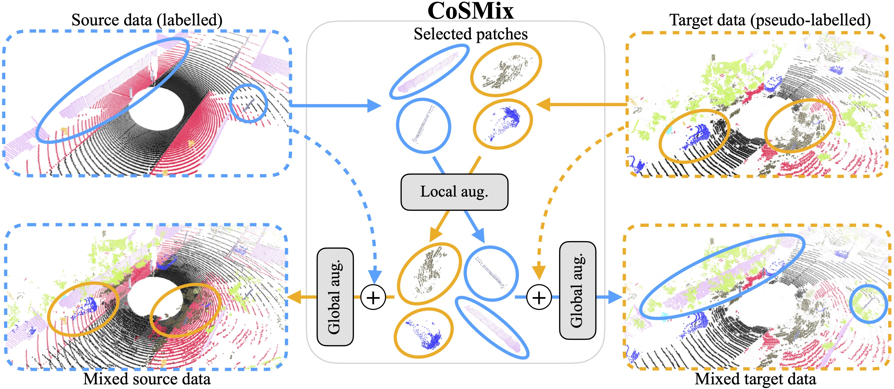
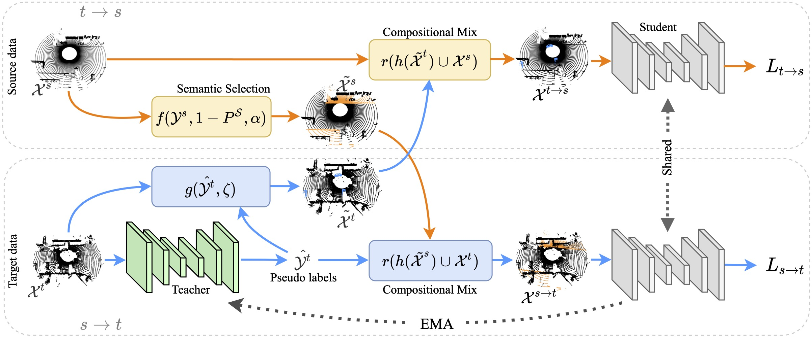

# **CoSMix: Compositional Semantic Mix for Domain Adaptation in 3D LiDAR Segmentation [ECCV2022 - TPAMI]**

The official implementation of our works "CoSMix: Compositional Semantic Mix for Domain Adaptation in 3D LiDAR Segmentation" and "Compositional Semantic Mix for Domain Adaptation in Point Cloud Segmentation".


## Introduction

Several Unsupervised Domain Adaptation (UDA) methods for point cloud data have been recently proposed to improve model generalization for different sensors and environments.
Meanwhile, researchers working on UDA problems in the image domain have shown that sample mixing can mitigate domain shift.
We propose a new approach of sample mixing for point cloud UDA, namely Compositional Semantic Mix (CoSMix), the first UDA approach for point cloud segmentation based on sample mixing.
CoSMix consists of a two-branch symmetric network that can process synthetic labelled data (source) and real-world unlabelled point clouds (target) concurrently.
Each branch operates on one domain by mixing selected pieces of data from the other one, and by using the semantic information derived from source labels and target pseudo-labels.
We further extend CoSMix for the one-shot semi-supervised DA settings (SSDA). In this extension, (one-shot) target labels are easily integrated in our pipeline,
providing additional noise-free guidance during adaptation.

:fire: For more information follow the [PAPER](https://ieeexplore.ieee.org/document/10234713) link!:fire:

Authors: [Cristiano Saltori](https://scholar.google.com/citations?user=PID7Z4oAAAAJ&hl),
         [Fabio Galasso](https://scholar.google.com/citations?user=2gSuGBEAAAAJ&hl),
         [Giuseppe Fiameni](https://scholar.google.com/citations?user=Se2mLvIAAAAJ&hl),
         [Nicu Sebe](https://scholar.google.it/citations?user=tNtjSewAAAAJ&hl),
         [Elisa Ricci](https://scholar.google.ca/citations?user=xf1T870AAAAJ&hl),
         [Fabio Poiesi](https://scholar.google.co.uk/citations?user=BQ7li6AAAAAJ&hl)



## News :bell:
- 3/2024: CoSMix SSDA code has been **RELEASED**!
- 8/2023: CoSMix extension to one-shot SSDA has been accepted at T-PAMI!:fire:  [Paper link](https://ieeexplore.ieee.org/document/10234713)
- 12/2022: CoSMix leads the new SynLiDAR to SemanticKITTI [benchmark](https://paperswithcode.com/sota/3d-unsupervised-domain-adaptation-on-synlidar)! :rocket:
- 7/2022: CoSMix code has been **RELEASED**!
- 7/2022: CoSMix is accepted to ECCV 2022!:fire: Our work is the first using compositional mix between domains to allow adaptation in LiDAR segmentation!

## Installation
The code has been tested with Docker (see Docker container below) with Python 3.8, CUDA 10.2/11.1, pytorch 1.8.0 and pytorch-lighting 1.4.1.
Any other version may require to update the code for compatibility.

### Pip/Venv/Conda
In your virtual environment follow [MinkowskiEnginge](https://github.com/NVIDIA/MinkowskiEngine).
This will install all the base packages.

Additionally, you need to install:
- [open3d 0.13.0](http://www.open3d.org)
- [pytorch-lighting 1.4.1](https://www.pytorchlightning.ai)
- [wandb](https://docs.wandb.ai/quickstart)
- tqdm
- pickle


### Docker container
If you want to use Docker you can find a ready-to-use container at ```crissalto/online-adaptation-mink:1.3```, just be sure to have installed drivers compatible with CUDA 11.1.


## Data preparation

### SynLiDAR
Download SynLiDAR dataset from [here](https://github.com/xiaoaoran/SynLiDAR), then prepare data folders as follows:
```
./
├── 
├── ...
└── path_to_data_shown_in_config/
    └──sequences/
        ├── 00/           
        │   ├── velodyne/	
        |   |	├── 000000.bin
        |   |	├── 000001.bin
        |   |	└── ...
        │   └── labels/ 
        |       ├── 000000.label
        |       ├── 000001.label
        |       └── ...
        └── 12/
```

### SemanticKITTI
To download SemanticKITTI follow the instructions [here](http://www.semantic-kitti.org). Then, prepare the paths as follows:
```
./
├── 
├── ...
└── path_to_data_shown_in_config/
      └── sequences
            ├── 00/           
            │   ├── velodyne/	
            |   |	   ├── 000000.bin
            |   |	   ├── 000001.bin
            |   |	   └── ...
            │   ├── labels/ 
            |   |      ├── 000000.label
            |   |      ├── 000001.label
            |   |      └── ...
            |   ├── calib.txt
            |   ├── poses.txt
            |   └── times.txt
            └── 08/
```

### SemanticPOSS
To download SemanticPOSS follow the instructions [here](http://www.poss.pku.edu.cn/semanticposs.html). Then, prepare the paths as follows:
```
./
├── 
├── ...
└── path_to_data_shown_in_config/
      └── sequences
            ├── 00/           
            │   ├── velodyne/	
            |   |	   ├── 000000.bin
            |   |	   ├── 000001.bin
            |   |	   └── ...
            │   ├── labels/ 
            |   |      ├── 000000.label
            |   |      ├── 000001.label
            |   |      └── ...
            |   ├── tag
            |   ├── calib.txt
            |   ├── poses.txt
            |   └── instances.txt
            └── 06/
```


After you downloaded the datasets you need, create soft-links in the ```data``` directory
```
cd cosmix-uda
mkdir data
ln -s PATH/TO/SEMANTICKITTI SemanticKITTI
# do the same for the other datasets
```

# Compositional Semantic Mix (CoSMix)



## Source pre-training

We use SynLiDAR as source synthetic dataset. 
The first stage of CoSMix consists of a warm-up stage in which the teacher is pretrained on the source dataset.
To warm-up the segmentation model on SynLiDAR2SemanticKITTI run

```
python train_source.py --config_file configs/source/synlidar2semantickitti.yaml
```


while to warm-up the segmentation model on SynLiDAR2SemanticPOSS run

```
python train_source.py --config_file configs/source/synlidar2semanticposs.yaml
```

**NB:** we provide source pretrained models, so you can skip this step and move directly on adaptation! :rocket:

**NB:** the code uses wandb for logs. Follow the instructions [here](https://docs.wandb.ai/quickstart) and update your ```config.wandb.project_name``` and ```config.wandb.entity_name```.


## Pretrained models :rocket:

You can download the pretrained models on both SynLiDAR2SemanticKITTI and SynLiDAR2SemanticPOSS form [here](https://drive.google.com/file/d/1cwRaIobmU0-DKDaic6Y7UX03O7MAFBV5/view?usp=sharing) and decompress them in ```cosmix-uda/pretrained_models/```.


## CoSMix - UDA

To adapt with CoSMix-UDA on SynLiDAR2SemanticKITTI run

```
python adapt_cosmix_uda.py --config_file configs/adaptation/uda/synlidar2semantickitti_cosmix.yaml
```

while to adapt with CoSMix-UDA on SynLiDAR2SemanticPOSS run

```
python adapt_cosmix_uda.py --config_file configs/adaptation/uda/synlidar2semanticposs_cosmix.yaml
```


## CoSMix - SSDA

First, finetune the pre-trained model by running 
```
python finetune_ssda.py --config_file configs/finetuning/synlidar2semantickitti_custom.yaml
```
this will finetune the pre-trained model over one-shot labelled samples from the target domain (check the paper for additional info).

To adapt with CoSMix-SSDA on SynLiDAR2SemanticKITTI run
```
python adapt_cosmix_ssda.py --config_file configs/adaptation/synlidar2semantickitti_cosmix.yaml
```
Repeat the same procedure for SemanticPOSS.

**NB:** Remember to update model paths according to your pre-trained model path and the WANDB information of your account.

# Evaluation

To evaluate pretrained models after warm-up
```
python eval.py --config_file configs/config-file-of-the-experiment.yaml --resume_path PATH-TO-EXPERIMENT
```

with ```--eval_source``` for running evaluation on source data and ```--eval_target``` on target data.
This will iterate over all the checkpoints and run evaluation of all the checkpoints in ```PATH-TO-EXPERIMENT/checkpoints/```.

Similarly, after adaptation use
```
python eval.py --config_file configs/config-file-of-the-experiment.yaml --resume_path PATH-TO-EXPERIMENT --is_student
```

Where ```--is_student``` specifies that the model to be evaluated is a student model.

You can save predictions for future visualizations by adding ```--save_predictions```.

# References
If you use our work, please cite us:
```
@article{saltori2023compositional,
  title={Compositional Semantic Mix for Domain Adaptation in Point Cloud Segmentation},
  author={Saltori, Cristiano and Galasso, Fabio and Fiameni, Giuseppe and Sebe, Nicu and Poiesi, Fabio and Ricci, Elisa},
  journal={IEEE Transactions on Pattern Analysis and Machine Intelligence},
  year={2023},
  publisher={IEEE}
}

@inproceedings{saltori2022cosmix,
  title={Cosmix: Compositional semantic mix for domain adaptation in 3d lidar segmentation},
  author={Saltori, Cristiano and Galasso, Fabio and Fiameni, Giuseppe and Sebe, Nicu and Ricci, Elisa and Poiesi, Fabio},
  booktitle={European Conference on Computer Vision},
  pages={586--602},
  year={2022},
  organization={Springer}
}
```

## Acknowledgments
This work was partially supported by OSRAM GmbH, by the MUR PNRR project FAIR (PE00000013) funded by the NextGenerationEU, by the EU project FEROX Grant Agreement no 101070440, by the PRIN PREVUE (Prot. 2017N2RK7K), the EU ISFP PROTECTOR (101034216) and the EU H2020 MARVEL (957337) projects and, it was carried out in the Vision and Learning joint laboratory of FBK and UNITN.

## Thanks

We thank the opensource project [MinkowskiEngine](https://github.com/NVIDIA/MinkowskiEngine).
